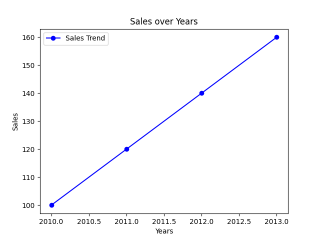

# Day 6: Data Visualization with Matplotlib and Seaborn

Welcome to Day 6! You can clean, merge, and group massive datasets. But if you try to show a table with 10,000 statistical averages to a client, their eyes will glaze over.

Humans understand shapes, colors, and trends. In Data Science, visualization is just as important as the math. Today, we introduce the two graphing heavyweights of Python: **Matplotlib** and **Seaborn**.

## Matplotlib: The Foundation
Matplotlib is the grandfather of Python plotting. It allows you to draw almost anything, from a simple line to 3D topographical map.

Let's look at `day6_ex1.py` to see three of the most common plots you will ever use.

### 1. The Line Plot
Used for tracking changes over time (trends).
```python
import matplotlib.pyplot as plt

years = [2010, 2011, 2012, 2013]
sales = [100, 120, 140, 160]

plt.plot(years, sales, label="Sales Trend", color="blue", marker="o")
plt.title("Sales over Years")
plt.xlabel("Years")
plt.ylabel("Sales")
plt.legend()
plt.show() # This actually launches a window to display the graph!
```



## Wrapping Up Day 6
You are now capable of telling a story with your data. You can show trends, plot correlations, and visualize massive datasets in a single glance.

Tomorrow is **Day 7: The EDA Project**. We will combine everything we've learned this week—from NumPy math to Pandas grouping to Seaborn plotting—into a comprehensive Exploratory Data Analysis project on a real-world dataset!
