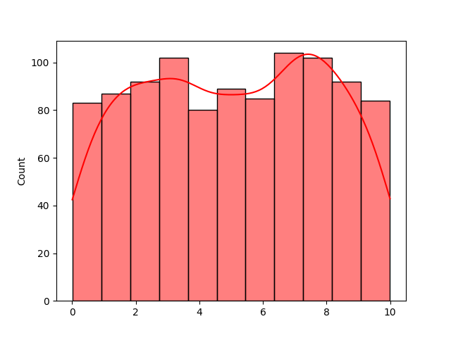

# Day 2: Probability Distributions in Machine Learning

Welcome back to Day 2! Real world data is not perfectly uniform. It clumps around a central "average" and thins out at the extremes. 

These patterns are so consistent that mathematicians have named them. In Machine Learning, we call them **Probability Distributions**. 

Today, we dive into the four most important distributions and how to analyze their physical "shape" using Skewness and Kurtosis.

## The Big Four Distributions

Let's look at `day2_samples.py` to see the code behind the mathematical curves the real world follows. We can use `scipy.stats` to generate the theoretical plots!

### 1. Gaussian (Normal) Distribution
The king. The Bell Curve. This continuous distribution is perfectly symmetric around its Mean ($\mu$), meaning the Mean, Median, and Mode are exactly the same. The spread of the bell is determined by its Standard Deviation ($\sigma$).

It powers many foundational algorithms like **Naive Bayes**, and we use it constantly when "Standardizing" data before feeding it into a neural network.

```python
# day2_samples.py
import numpy as np
import matplotlib.pyplot as plt
from scipy.stats import norm, binom, poisson
import seaborn as sns

# Plotting the perfect Gaussian Distribution
x = np.linspace(-4, 4, 100)
plt.plot(x, norm.pdf(x, loc=0, scale=1), label="Gaussian (u=0, s=1)")
```

### 2. Binomial Distribution
A discrete distribution. It tracks the number of "successes" across $n$ independent "yes/no" trials (like flipping 10 coins and seeing how many are heads).

In AI, **Logistic Regression** assumes this distribution when modeling binary classification (Spam vs. Not Spam).

```python
import numpy as np
n, p = 10, 0.5
x = np.arange(0, n+1)
# Plotting the Binomial (Notice we use a Bar chart because it is Discrete!)
plt.bar(x, binom.pmf(x, n, p), alpha=0.7, label="Binomial (n=10, p=0.5)")
# Output:
# Traceback (most recent call last):
#   ...
# NameError: name 'binom' is not defined
```

### 3. Poisson Distribution
Another discrete distribution. It models how many times a specific event happens in a fixed interval of *time or space* (e.g., How many cars pass a tollbooth per hour).

Often used in time-series forecasting algorithms.

```python
import numpy as np
# Average rate (\lambda) is 3 events per interval
lam = 3
x = np.arange(0,10)
plt.bar(x, poisson.pmf(x, lam), alpha=0.7, label="Poisson (l = 3)")
# Output:
# Traceback (most recent call last):
#   ...
# NameError: name 'poisson' is not defined
```

### 4. Uniform Distribution
Continuous distribution where every single outcome in a range $[a, b]$ has an identical, flat probability of happening.

**Deep Learning use case:** Neural Networks randomly initialize their weights from a uniform distribution so no single node is given unfair priority at the start!

```python
import seaborn as sns
import numpy as np
x = np.random.uniform(low=0, high=10, size=1000)
sns.histplot(x, kde=True, label="Uniform", color="red")
plt.show()
```



## Wrapping Up Day 2
You now recognize the curves governing the real world. You can visualize them visually using Seaborn, and you know which algorithms assume which curves.

Tomorrow on **Day 3: Statistical Inference**, we will learn the magic trick of statistics. How can we estimate the shape of an entire distribution just by looking at a tiny sample? Confidence Intervals await!
