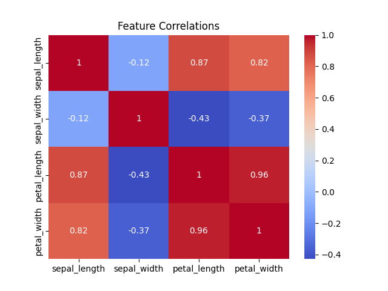

# Day 6: Correlation and Regression Analysis

Welcome to Day 6! Tomorrow, you build your final project for Math Week. Before you can build it, you must select the *right* data to feed it. 

If you throw 5,000 columns of data into an AI model, it will take hours to train and probably overfit. You must filter the data down to only the columns that mathematically matter. How? **Correlation**.

## Understanding Correlation
Correlation measures the strength and direction of the linear relationship between two continuous variables. 
*   **1.0:** Perfect positive relationship (As X goes up, Y goes exactly up).
*   **-1.0:** Perfect negative relationship (As X goes up, Y goes exactly down).
*   **0.0:** No relationship. The variables are completely independent.

In Week 2 we used Pandas `.corr()` and Seaborn `heatmap` visually. Let's look at `day6_ex1.py` to see the math again using the famous Iris dataset:

```python
# day6_ex1.py
import pandas as pd
import seaborn as sns
import matplotlib.pyplot as plt

df = pd.read_csv("https://raw.githubusercontent.com/mwaskom/seaborn-data/master/iris.csv")

# We drop the categorical species column before doing math
del df["species"]

# This calculates the Pearson Correlation Coefficient (r) for every pair!
correlation_matrix = df.corr()

# Visualize the resulting 1.0 to -1.0 scores!
sns.heatmap(correlation_matrix, annot=True, cmap="coolwarm")
plt.title("Feature Correlations")
plt.show()
```



## Interpreting Regression
When you run `.score()` in classification, it gives you "Accuracy" (e.g., "95% correct").
When you run `.score()` in Regression, it gives you **R-Squared ($R^2$)**.

$R^2$ is a statistical measure that represents the proportion of the variance in the dependent variable that is mathematically explained by the independent variable. An $R^2$ of 1.0 means your line is utterly perfect. An $R^2$ of 0.0 means your model is drawing a flat, mathematically useless line.

## Wrapping Up Day 6
The power of `Scikit-Learn` is undeniable. All the math is hidden behind intuitive class methods.

Tomorrow, on **Day 7: The Final Project - Real-World Statistics**, we put everything together. We will load a real dataset, perform an EDA, run a Hypothesis Test, calculate the Correlations, and build a Regression Model!
