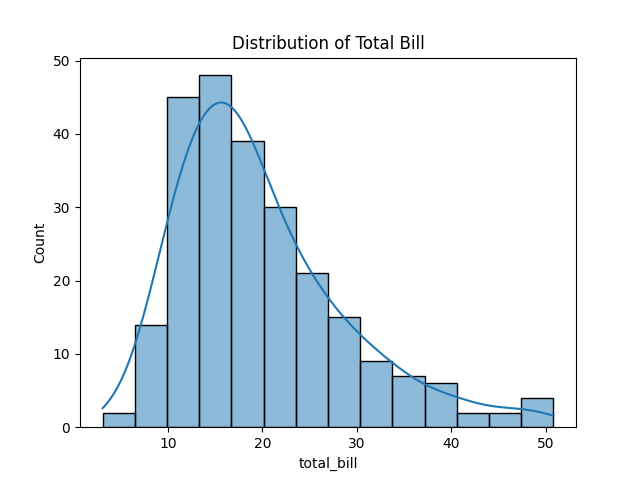

# Day 7: Statistical Analysis Project - Analyzing Real-World Data

Welcome to the end of Week 4. Over the last month, we have learned the syntax of Python, the tools of Data Science, and the engine of Mathematics.

Today is our final capstone before we officially enter the world of Machine Learning algorithms next week. 

We are going to take the famous "Tips" dataset (which records waitstaff tips based on the total bill, gender of the customer, and whether they smoke), and perform a complete **Statistical Analysis Pipeline**.

## The Analytical Pipeline

### 1. Exploratory Data Analysis (EDA)
Before we write any math, we must look at the data shape. We load the CSV, ask Pandas for a summary, and plot the distribution of our primary variable (the Total Bill) using Seaborn.

```python
# day7_project.py
import pandas as pd
import numpy as np
import seaborn as sns
import matplotlib.pyplot as plt

# 1. Load Dataset
url = "https://raw.githubusercontent.com/mwaskom/seaborn-data/master/tips.csv"
df = pd.read_csv(url)

# 2. Inspect Data
print(df.info())
print(df.describe())

# 3. Visualize Distributions
sns.histplot(df["total_bill"], kde=True)
plt.title("Distribution of Total Bill")
plt.show() # Output reveals a positive skew! Most bills are $10-$20.
# Output:
# <class 'pandas.DataFrame'>
# RangeIndex: 244 entries, 0 to 243
# Data columns (total 7 columns):
#  #   Column      Non-Null Count  Dtype  
# ---  ------      --------------  -----  
#  0   total_bill  244 non-null    float64
#  1   tip         244 non-null    float64
#  2   sex         244 non-null    str    
#  3   smoker      244 non-null    str    
#  4   day         244 non-null    str    
#  5   time        244 non-null    str    
#  6   size        244 non-null    int64  
# dtypes: float64(2), int64(1), str(4)
# memory usage: 17.3 KB
# None
#        total_bill         tip        size
# count  244.000000  244.000000  244.000000
# mean    19.785943    2.998279    2.569672
# std      8.902412    1.383638    0.951100
# min      3.070000    1.000000    1.000000
# 25%     13.347500    2.000000    2.000000
# 50%     17.795000    2.900000    2.000000
# 75%     24.127500    3.562500    3.000000
# max     50.810000   10.000000    6.000000
```



### 2. Hypothesis Testing
Let's ask a question: *Do Men tip more than Women?* 

We cannot answer this by just looking at the average tips of men vs women in this specific restaurant. We must calculate the P-Value to see if the difference is statistically significant.

```python
from scipy.stats import ttest_ind

# Separate data by gender
male_tips = df[df['sex'] == 'Male']['tip']
female_tips = df[df['sex'] == 'Female']['tip']

# Perform Independent T-Test
t_stat, p_value = ttest_ind(male_tips, female_tips)
print("P-Value: ", p_value)

# Interpret results
alpha = 0.05
if p_value <= alpha:
    print("Reject the null hypothesis: Significant difference.")
else:
    print("Fail to Reject the null hypothesis: NO Significant difference.")

# Output: P-Value: 0.166. 
# There is NO statistical difference in how men and women tip!
# Output:
# Traceback (most recent call last):
#   ...
# NameError: name 'df' is not defined
```

### 3. Correlation and Regression
Okay, if Gender doesn't predict tip size, what does? We do a quick correlation heatmap (dropping Categorical strings first) and see that `total_bill` is highly correlated with `tip`. 

Let's build a Scikit-Learn Regression model to predict exactly how much money a waiter will make based strictly on the bill amount!

```python
from sklearn.linear_model import LinearRegression

# Pandas features must be reshaped into 2D Matrices to work in sklearn!
X = df['total_bill'].values.reshape(-1, 1)
y = df['tip'].values

# Fit linear regression
model = LinearRegression()
model.fit(X, y)

# Output coefficients
print("Slope (Tip per Dollar): ", model.coef_[0])
print("Intercept (Base Tip): ", model.intercept_)
print("R-Squared:", model.score(X, y))
# Output:
# Traceback (most recent call last):
#   ...
# NameError: name 'df' is not defined
```

## Wrapping Up Week 4!
Congratulations! You have completed the foundation. You know exactly how to handle messy data, mathematically prove your hypotheses, and predict continuous variables. 

**Next Week**: The fun truly begins. We enter **Week 5: Machine Learning Fundamentals**, where we build our very first Classification models to predict distinct categories, train Decision Trees, and learn how to properly slice data into Training and Testing sets! See you there.
